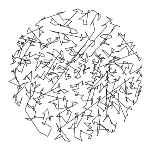

# Coachable Take Home Study


Thank you for applying to Coachable! If you're receiving this, that means that we think your applicaiton to Coachable is promising, but we noticed a gap in coding background that we think would be helpful when starting in the Coachable Growth Path. To bridge this gap, we've provided a set of resources and exercises for you to work. 

If you can complete these exercsies within 1 month, then we'll schedule an interview to discuss the assignments (mostly to make sure you understand them, nothing too crazy) and from there you'll have a very good chance of being selected to join Coachable's Growth Path. 

__Your Task.__ We'll provide several resources and 3 assignments to work on. If you can complete these within 1 month, then we'll schedule an interview to discuss the assignments (mostly to make sure you understand them) and from there we can have you get started with the mentorship.

__Questions/Office Hours__ If you have any questions regarding the material we encourage you to ask them. In fact, we'd be surprised if you didn't have any questions. We also will schedule 1 offifce hours session to answer any quesitons and discuss what you have learned. This will be like a typical coaching session in Coachable. It’s important to bring any questions regarding the material you are stuck on. I’d recommend trying to get through the first assignment before scheduling an office hours session. When you are ready with a set of questions, please feel free to email [darek@coachable.dev](mailto:darek@coachable.dev) and we can set up a time to discuss. Of course if it's only a small clarifying question, feel free to drop a short email. 


## Pt 1. Python Syntax, Conditionals, Loops, and Functions
The first will focus on basic PYthon  has some basic Python coding portions. Here are the resources we think you'll need.

### Resources 

We use Princeton's Intro to CS Booksite as reference, but feel free to use other resources if some topics are not clear from the booksite.

0. Base Booksite Directory - https://introcs.cs.princeton.edu/python/home/
1. Hello World - https://introcs.cs.princeton.edu/python/11hello/
2. Built-In Data Types - https://introcs.cs.princeton.edu/python/12types/
3. Conditionals and Loops - https://introcs.cs.princeton.edu/python/13flow/
4. Arrays - https://introcs.cs.princeton.edu/python/14array/
5. Functions - https://introcs.cs.princeton.edu/python/21function/
6. Modules and Clients - https://introcs.cs.princeton.edu/python/22module/
7. Recursion - https://introcs.cs.princeton.edu/python/23recursion/

Once you've read through the above resources, you can get started on implementing the problems outlined in `starter.py`

## Pt 2/3.  Traveling Salesperson Problem

Given N points in the plane, the goal of a traveling salesperson is to visit all of them (and arrive back home) while keeping the total distance traveled as short as possible. Implement two greedy heuristics to find good (but not optimal) solutions to the traveling salesperson problem (TSP).


__Perspective.__ The importance of the TSP does not arise from an overwhelming demand of salespeople to minimize their travel distance, but rather from a wealth of other applications such as vehicle routing, circuit board drilling, VLSI design, robot control, X-ray crystallography, machine scheduling, and computational biology.

__Greedy heuristics.__ The traveling salesperson problem is a notoriously difficult _combinatorial optimization_ problem, In principle, one can enumerate all possible tours and pick the shortest one; in practice, the number of tours is so staggeringly large (roughly N factorial) that this approach is useless. For large N, no one knows an efficient method that can find the shortest possible tour for any given set of points. However, many methods have been studied that seem to work well in practice, even though they are not guaranteed to produce the best possible tour. Such methods are called _heuristics_. Your main task is to implement the nearest neighbor and smallest increase insertion heuristics for building a tour incrementally. Start with a one-point tour (from the first point back to itself), and iterate the following process until there are no points left.

- _Nearest neighbor heuristic_:  Read in the next point, and add it to the current tour after the point to which it is closest. (If there is more than one point to which it is closest, insert it after the first such point you discover.)
- _Smallest increase heuristic_:  Read in the next point, and add it to the current tour after the point where it results in the least possible increase in the tour length. (If there is more than one point, insert it after the first such point you discover.)

## Pt 2. Point data type.
`point.py` represents a point in the plane, as described by the following API:

```
class Point (2D point data type)        
-------------------------------------------------------------------------------
def __init__(self, x, y)             # create the Point (x, y)
def draw(self)                       # draw point using stddraw
def drawTo(self, that)               # draw line segment between the two points
def distanceTo(self, that)           # return Euclidean distance between the two points
```

Each `Point` object can draw itself to standard draw, draw a line segment from itself to another point using standard draw, and calculate the Euclidean distance between itself and another point. If need to get familiar with Python and using the std libraries, please check out the [Princeton Booksite](https://introcs.cs.princeton.edu/python/code/) for how to use them.

### Resources

This part will require you to do object oriented programming, write functions and use standard libraries. Here are the resources we think you'll need.

1. Standard Libraries - https://introcs.cs.princeton.edu/python/code/. You can import them directly or use pip to install them.
5. Functions - https://introcs.cs.princeton.edu/python/21function/
2. Using Data Types - https://introcs.cs.princeton.edu/python/31datatype/
3. Creating Data Types - https://introcs.cs.princeton.edu/python/32class/
4. Designing Data Types - https://introcs.cs.princeton.edu/python/33design/


__Bonus__. IF you'd like to challenges yourself a bit, you can implement an N-dimensional `Point` class in `point.py`. More instructions on the APIs will be included there. This is encouraged, but definitely not required.

## Pt 3 . Tour data type.
This part will require you read and learn about LinkedLists. Here are the resources we think you'll need to complete Tour

### Resources 

1. Performance - https://introcs.cs.princeton.edu/python/41analysis/
2. Stack / Queues - https://introcs.cs.princeton.edu/python/43stack/

These resources may not be sufficient so if there are parts still confusing, please feel free to poke around on the internet to fill the gaps.

## Assignment
Your task is to create a `Tour` data type that represents the sequence of points visited in a TSP tour. Represent the tour as a circular linked list of nodes, one for each point. Each Node will contain a Point and a reference to the next Node in the tour. Within `tour.py`, define a nested class `Node` in the standard way:

```
class Node:
    def __init__(self, point):
        self.point = point # This node's point
        self.next = None   # Next node
```

Your `Tour` data type must implement the following API:

```
class Tour:          
    def __init__(self):                           # create an empty tour
    def draw(self):                               # draw the tour to standard draw
    def size(self):                               # number of points on tour
    def distance(self):                           # return the total distance of the tour
    def insertNearest(self, p):                   # insert p using nearest neighbor heuristic
    def insertSmallest(self, p):                  # insert p using smallest increase heuristic
```

Each Tour object should be able to print its constituent points to standard output, draw its points to standard draw, count its number of points, compute its total distance, and insert a new point using either of the two heuristics. The constructor creates an empty tour.

- _Constructors._ Create a `Tour` object.
    - Initialize whatever you think is necessary here.
- _draw._ Here you will want to iterate through all the points in the tour and call their 'drawTo()' method. 
- _insertNearest._ Refer to _Nearest neighbor heuristic_ text above.
- _insertSmallest._ Refer to _Smallest increase heuristic_ text above.


__Input and testing.__ The input format will begin with two integers w and h, followed by pairs of x- and y-coordinates. All x-coordinates will be real numbers between 0 and w; all y-coordinates will be real numbers between 0 and h. Many test data files are available. As an example, [tsp1000.txt](tsp1000.txt) contains the following data:
```
% more tsp1000.txt
775 768
185.0411 457.8824
247.5023 299.4322
701.3532 369.7156
563.2718 442.3282
144.5569 576.4812
535.9311 478.4692
383.8523 458.4757
329.9402 740.9576
...
254.9820 302.2548
```
After implementing `tour.py`, use the client program [nearest_insertion.py](nearest_insertion.py) to read in the points from standard input, run the nearest neighbor heuristic; print the resulting tour, its distance, and its number of points to standard output; and draw the resulting tour to standard draw. [smallest_insertion.py](smallest_insertion.py) is analogous but runs the smallest insertion heuristic.

```
% python nearest_insertion.py < tsp1000.txt
Tour distance = 27868.7106
Number of points = 1000
(185.0411, 457.8824)
(198.3921, 464.6812)
(195.8296, 456.6559)
(216.8989, 455.126)
(213.3513, 468.0186)
(241.4387, 467.413)
(259.0682, 473.7961)
(221.5852, 442.8863)
...
(264.57, 410.328)
```



```            
% python smallest_insertion.py < tsp1000.txt
Tour distance = 17265.6282
Number of points = 1000
(185.0411, 457.8824)
(195.8296, 456.6559)
(193.0671, 450.2405)
(200.7237, 426.3461)
(200.5698, 422.6481)
(217.4682, 434.3839)
(223.1549, 439.8027)
(221.5852, 442.8863)
...
(186.8032, 449.9557)
```


__Questions__. Test the runtime of your function? How does the runtime grow as you double the input size _N_ starting from _N_ = 1,000.
